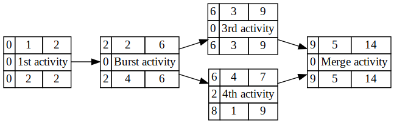
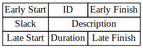

# csv_to_gv_aon
Create an Activity-on-Node diagram from a CSV file

## How to use
`./csv_to_gv_aon /path/to/csv | dot -Tpng -o out.png`

## Sample input

| Activity | Description | Duration | Predecessor |
| --- | --- | --- | --- |
| 1 | 1st activity | 2 | |
| 2 | Burst activity | 4 | 1 |
| 3 | 3rd activity | 3 | 2 |
| 4 | 4th activity | 1 | 2 |
| 5 | Merge activity | 5 | 3,4 |

## Sample output

## Output format
