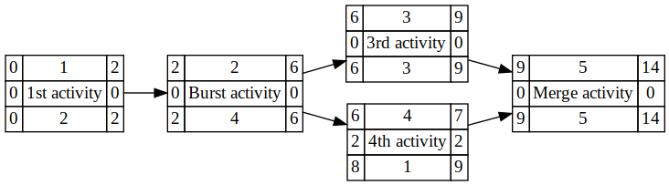
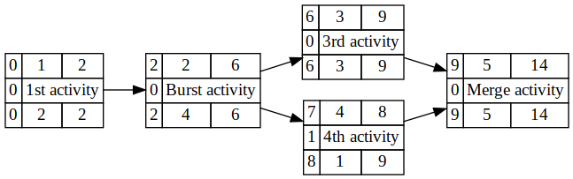
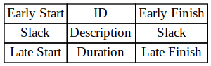

# csv_to_gv_aon
Create an Activity-on-Node diagram from a CSV file

## How to use
This program does not actually draw the diagram itself, it actually outputs <a href="https://en.wikipedia.org/wiki/DOT_(graph_description_language)">DOT</a>, which can be piped into the `dot` program from GraphViz. One way to actually generate an image is: `./csv_to_gv_aon /path/to/csv | dot -Tpng -o out.png`.

### Command line parameters
This program supports two parameters, which are:
 - `--dslack`: Places the slack value on both sides of the description as opposed to just the left side
 - `--estats`: Calculate the statistics based on given early start and late finish values in the CSV (so 2 more columns are required for them in that order)

The file name must be the first parameter, followed by the other parameters. The extra parameters are optional, and can be in any order.

## Sample input

| Activity | Description | Duration | Predecessor | Early Start | Late Finish
| --- | --- | --- | --- | --- | ---
| 1 | 1st activity | 2 | | 0 | 2
| 2 | Burst activity | 4 | 1 | 2 | 6
| 3 | 3rd activity | 3 | 2 | 6 | 9
| 4 | 4th activity | 1 | 2 | 7 | 9
| 5 | Merge activity | 5 | 3,4 | 9 | 14

## Sample output

### With the `--dslack` option:

### With the `--estats` option:

## Output format

### With the `--dslack` option:

